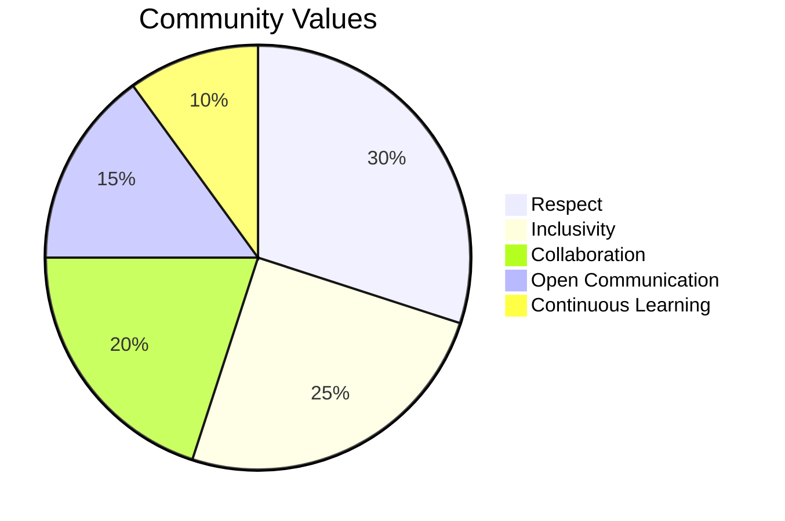

# 🌟 Open Source Contribution Guide 
[](https://github.com/Naereen/badges/)

<a href="https://github.com/theriturajps"></a>


[](https://git-scm.com) [](https://visualstudio.microsoft.com)  [](https://microsoft.com/windows/)  

Welcome to the world of open-source contribution! This guide will walk you through the process of making your first pull request. Let's get started! 🚀

## 📋 Table of Contents

- [🌟 Open Source Contribution Guide](#-open-source-contribution-guide)
  - [📋 Table of Contents](#-table-of-contents)
  - [🛠️ Installing Git on Windows 11 \& macOS](#️-installing-git-on-windows-11--macos)
    - [Windows 11](#windows-11)
    - [macOS](#macos)
  - [🧑‍💻 Setting up VSCode](#-setting-up-vscode)
  - [🔑 Configuring SSH Key to Upload from Your PC or VSCode](#-configuring-ssh-key-to-upload-from-your-pc-or-vscode)
    - [1. **Generate an SSH Key**](#1-generate-an-ssh-key)
      - [For Windows 11:](#for-windows-11)
      - [For macOS:](#for-macos)
    - [2. **Add the SSH Key to the SSH Agent**](#2-add-the-ssh-key-to-the-ssh-agent)
      - [Windows 11:](#windows-11-1)
      - [macOS:](#macos-1)
    - [3. **Find Your SSH Key**](#3-find-your-ssh-key)
      - [Windows 11 \& macOS:](#windows-11--macos)
    - [4. **Add the SSH Key to Your GitHub Account**](#4-add-the-ssh-key-to-your-github-account)
    - [5. **Verify Your SSH Connection**](#5-verify-your-ssh-connection)
    - [6. **Configure Git to Use SSH**](#6-configure-git-to-use-ssh)
    - [7. **Use VSCode for Pushing Files**](#7-use-vscode-for-pushing-files)
  - [📚 Understanding Basic Git Commands](#-understanding-basic-git-commands)
  - [🌐 Contributing via GitHub (in-browser)](#-contributing-via-github-in-browser)
    - [1. 🍴 Fork the project](#1--fork-the-project)
    - [2. 🌿 Create a New Branch](#2--create-a-new-branch)
    - [3. ✏️ Edit the File](#3-️-edit-the-file)
    - [4. 🎯 Create a Pull Request](#4--create-a-pull-request)
  - [💻 Contributing Locally](#-contributing-locally)
    - [1. 🍴 Fork the project](#1--fork-the-project-1)
    - [2. 📥 Clone the repository](#2--clone-the-repository)
    - [3. 🌿 Create a new branch](#3--create-a-new-branch)
    - [4. 🖊️ Make your changes](#4-️-make-your-changes)
    - [5. 💾 Commit your changes](#5--commit-your-changes)
    - [6. 🚀 Push to GitHub](#6--push-to-github)
    - [7. 🎯 Create a Pull Request](#7--create-a-pull-request)
  - [🔀 Resolving Merge Conflicts](#-resolving-merge-conflicts)
  - [🤝 Community Guidelines](#-community-guidelines)
  - [📚 Additional Resources](#-additional-resources)

## 🛠️ Installing Git on Windows 11 & macOS

### Windows 11
1. **Download Git**: Head to [Git for Windows](https://git-scm.com/download/win) and download the installer.
2. **Install Git**:
    - Run the `.exe` file you downloaded.
    - Follow the setup wizard, leaving the default settings as is (recommended).
    - Make sure to select the option to use Git from the command line and third-party software.
3. **Verify Installation**:
    - Open **Command Prompt** or **PowerShell**.
    - Type `git --version` to ensure Git is installed correctly.

### macOS
1. **Using Homebrew**:
    - If you have Homebrew installed, open the **Terminal** and run:
    ```bash
    brew install git
    ```
2. **Without Homebrew**:
    - Download Git from [git-scm.com](https://git-scm.com/download/mac).
    - Open the `.dmg` file and follow the instructions.
3. **Verify Installation**:
    - Open the **Terminal**.
    - Type `git --version` to confirm Git is installed.

## 🧑‍💻 Setting up VSCode

1. **Download VSCode**:
   - Go to [Visual Studio Code](https://code.visualstudio.com/download) and download the appropriate installer for your system (Windows, macOS).
   
2. **Install the Git Extension**:
    - Open VSCode and navigate to the **Extensions** tab (left sidebar).
    - Search for `GitLens` and install it to enhance Git functionality within VSCode.

3. **Configure Git in VSCode**:
    - Open VSCode and press `Ctrl + ~` to launch the integrated terminal.
    - Set up your Git username and email:
    ```bash
    git config --global user.name "Your Name"
    git config --global user.email "your.email@example.com"
    ```

4. **Verify Git in VSCode**:
    - Run `git --version` in the terminal to check everything is configured correctly.

## 🔑 Configuring SSH Key to Upload from Your PC or VSCode

### 1. **Generate an SSH Key**

Before you can securely upload files from your PC or VSCode to GitHub, you'll need to generate an SSH key. Follow these steps based on your operating system.

#### For Windows 11:
1. **Open Git Bash** (installed with Git).
2. Run the following command to generate a new SSH key:
    ```bash
    ssh-keygen -t ed25519 -C "your_email@example.com"
    ```
    - If you are using a legacy system that doesn't support Ed25519, use:
    ```bash
    ssh-keygen -t rsa -b 4096 -C "your_email@example.com"
    ```

3. Press `Enter` to accept the default file location, and if prompted, enter a passphrase for additional security (you can leave this blank).

#### For macOS:
1. **Open Terminal**.
2. Use the same command to generate an SSH key:
    ```bash
    ssh-keygen -t ed25519 -C "your_email@example.com"
    ```

3. Press `Enter` to save the SSH key to the default location and set a passphrase if desired.

### 2. **Add the SSH Key to the SSH Agent**

You need to add your SSH private key to the SSH agent, which manages your keys.

#### Windows 11:
1. In **Git Bash**, start the SSH agent:
    ```bash
    eval "$(ssh-agent -s)"
    ```

2. Add your SSH key to the agent:
    ```bash
    ssh-add ~/.ssh/id_ed25519
    ```

#### macOS:
1. In **Terminal**, start the SSH agent:
    ```bash
    eval "$(ssh-agent -s)"
    ```

2. Add your SSH key:
    ```bash
    ssh-add -K ~/.ssh/id_ed25519
    ```

### 3. **Find Your SSH Key**

Now, you need to find your SSH public key and copy it to add it to GitHub.

#### Windows 11 & macOS:
1. Display the public key by running:
    ```bash
    cat ~/.ssh/id_ed25519.pub
    ```
2. Copy the entire output, which will look something like this:
    ```
    ssh-ed25519 AAAAC3NzaC1lZDI1NTE5AAAAIA2v2p2O... your_email@example.com
    ```

### 4. **Add the SSH Key to Your GitHub Account**

Now that you have your SSH key, add it to your GitHub account to enable secure uploads.

1. **Go to GitHub** and log in to your account.
2. In the upper-right corner of any page, click your profile photo, then click **Settings**.
3. In the left sidebar, click **SSH and GPG keys**.
4. Click **New SSH key**.
5. In the "Title" field, add a descriptive label for the new key (e.g., "My PC SSH Key").
6. Paste your SSH public key into the "Key" field.
7. Click **Add SSH key**.

### 5. **Verify Your SSH Connection**

To make sure your SSH key is correctly configured, test the connection:

1. In **Git Bash** (Windows) or **Terminal** (macOS), type:
    ```bash
    ssh -T git@github.com
    ```

2. If everything is set up correctly, you should see a message like:
    ```plaintext
    Hi username! You've successfully authenticated, but GitHub does not provide shell access.
    ```

### 6. **Configure Git to Use SSH**

Now that the SSH key is set up, you need to configure Git to use SSH for pushing to GitHub.

1. **Set Git to use SSH** by running:
    ```bash
    git remote set-url origin git@github.com:USERNAME/REPO-NAME.git
    ```

2. **Push your changes** as you normally would:
    ```bash
    git add .
    git commit -m "Your commit message"
    git push origin branch-name
    ```

### 7. **Use VSCode for Pushing Files**

If you’re using VSCode, you can push changes using the **Source Control** tab:

1. **Stage your changes**: Click the plus icon next to the files or folders you modified.
2. **Write a commit message** and hit the checkmark icon to commit your changes.
3. **Push to GitHub**: Click the three dots (ellipsis) at the top of the Source Control tab and select `Push`.

Your files will now be securely pushed to your GitHub repository using your SSH key!

## 📚 Understanding Basic Git Commands

Here are some essential Git commands you'll be using:


- `git init`: 🏁 Initialize a new Git repository.
- `git clone`: 📥 Copy a remote repository to your local machine.
- `git add`: ➕ Stage changes for the next commit.
- `git commit`: 💾 Save the changes you've staged.
- `git push`: 🚀 Upload your local commits to the remote repository.
- `git pull`: 🔄 Download and integrate changes from the remote repository.
- `git branch`: 🌿 List, create, or delete branches.
- `git checkout`: 🔀 Switch between different branches.

## 🌐 Contributing via GitHub (in-browser)


### 1. 🍴 Fork the project
- Click the `Fork` button at the top right of the project page to create your own copy.

### 2. 🌿 Create a New Branch
- On your forked repository page, click the `main` branch dropdown.
- Enter a name for your new branch (e.g., "add-my-name") and select "**Create branch**."

### 3. ✏️ Edit the File
- Navigate to the `README.md` file, and click the pencil icon to make edits.
- Add your name and GitHub profile link in alphabetical order.

### 4. 🎯 Create a Pull Request
- Go to the "**Pull requests**" tab in your forked repo.
- Click `New pull request`, add a title and description for your PR, and submit!

## 💻 Contributing Locally


### 1. 🍴 Fork the project
- Click `Fork` on the project page to create your own copy.

### 2. 📥 Clone the repository
```bash
git clone https://github.com/YOUR-USERNAME/REPO-NAME.git
cd REPO-NAME
```

### 3. 🌿 Create a new branch
```bash
git checkout -b branch-name
```

### 4. 🖊️ Make your changes
- Open the file you want to edit and make your changes.

### 5. 💾 Commit your changes
```bash
git add .
git commit -m "Add YOUR-NAME to contributors"
```

### 6. 🚀 Push to GitHub
```bash
git push origin branch-name
```

### 7. 🎯 Create a Pull Request
- Go to your forked repository, click on "Pull requests," and create a new PR!

## 🔀 Resolving Merge Conflicts

If you encounter a merge conflict, follow these steps:


1. Pull the latest changes from the upstream repository:
```bash
git pull upstream main
```

2. Resolve conflicts manually in your code editor.
3. Stage the resolved files:
```bash
git add .
```

4. Commit the changes:
```bash
git commit -m "Resolved merge conflicts"
```

5. Push the changes to your fork:
```bash
git push origin your-branch-name
```

## 🤝 Community Guidelines

We are committed to providing a welcoming and inclusive experience for all contributors. Please be respectful and follow our code of conduct when participating.



## 📚 Additional Resources

- 📘 [Pro Git Book](https://git-scm.com/book/en/v2)
- 🔍 [GitHub Guides](https://guides.github.com/)

Remember, every expert was once a beginner. Don't hesitate to ask questions and learn from your mistakes. 

**Happy Contributing!** 🎉

---

[](https://saythanks.io/to/kennethreitz)
[](https://twitter.com/riturajps)
